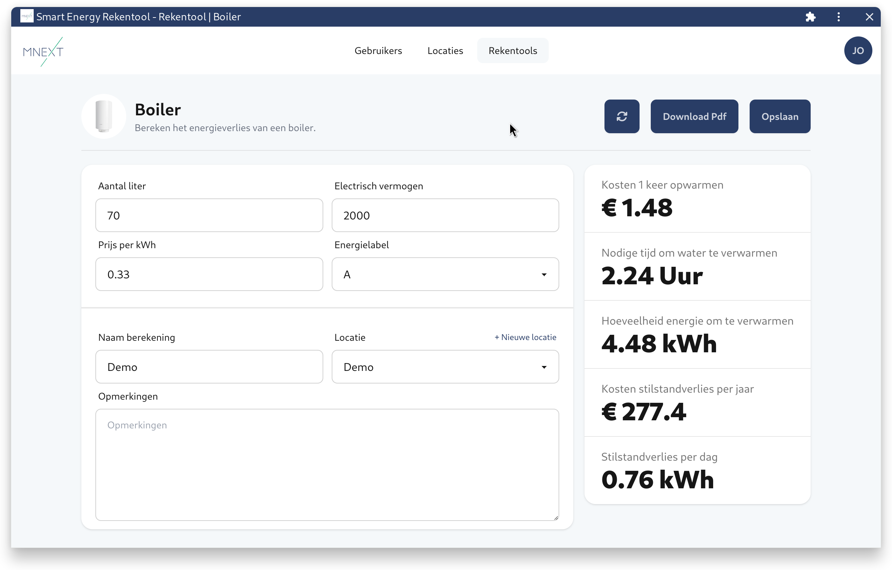

# Smart Energy Rekentool

  

Smart Energy Rekentool is een project gemaakt in opdracht van avans en mnext.nl. Het is bedoelt als hulpmiddel voor energiecoaches, welke deze tool kunnen gebruiken om verschillende berekeningen te maken.

### Project Setup
Het project bestaat uit 3 folders: docs, pocketbase en frontend. 
De docs folder bevat documentatie voor het installeren van het project op een server, en een document welke uitlegt hoe het project in elkaar zit.
In de frontend folder is de applicatie te vinden, deze is geschreven in angular. De frontend kan op de volgende manier gebouwd en gestart worden:
- Start dev server: npm start
- Bouw applicatie: npm run build
- Run linter: npm run format && npm run lint

De pocketbase folder bevat migraties en een systemd service.
Om het project lokaal te draaien is het handig om [pocketbase te downloaden](https://pocketbase.io/docs/) en deze in de pocketbase folder te plaatsen.
Daarna kan pocketbase op de volgende manier gestart worden: `./pocketbase serve`. Migraties zullen automatisch worden uitgevoerd en gegenereerd.

### Quality gate

